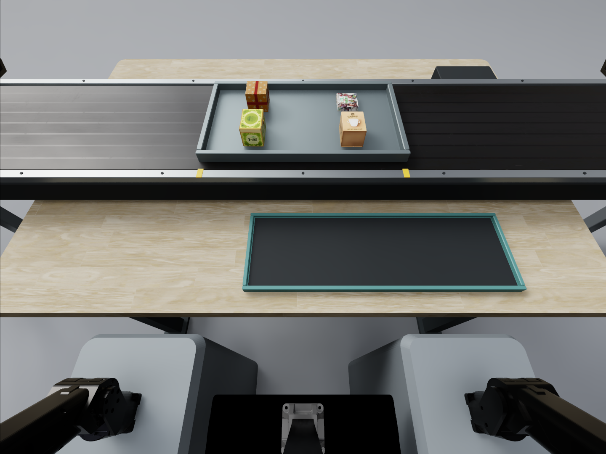
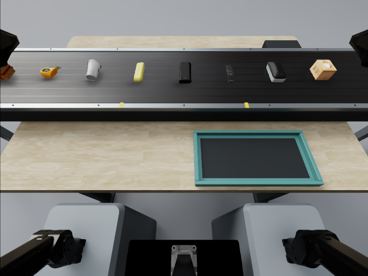

# PhysCo · 认知—动作耦合评测

PhysCo: A Benchmark for Cognitive–Motor Coupling in Robotic Manipulation

认知决定行动，物理效果确认进度，反馈更新后续决策。PhysCo 通过 5 项认知核心、5 项动作核心和 5 项耦合任务，研究机器人在完整操作流程中保持这种一致性的能力。

## Benchmark Insight

- 历史、规则和任务进度决定操作对象、目标、顺序与约束。
- 通过真实的抓取、落位、读数和接触效果确认阶段完成。
- 偏差与环境变化需要进入后续状态更新、任务推进和恢复决策。

认知—动作耦合描述任务依赖，适用于不同模型架构。评测设计面向 Coding Agents 与 E2E VLA/WAM，使用独立环境侧判据，并分别披露接口、训练条件、观察权限与时钟条件。

## 任务目录

- [E · 多批次物料重复件识别](cases/E.md)
- [P · 订单配餐](cases/P.md)
- [S · 旋转托盘颜色布局复原](cases/S.md)
- [F · 未知按钮映射与滑台导航](cases/F.md)
- [M · 工件流转追踪与路线复现](cases/M.md)
- [FR1 · 快递输送线连续取件](cases/FR1.md)
- [FR2 · 亮灯按钮连续响应](cases/FR2.md)
- [PR1 · 滑动变阻器阻值调节](cases/PR1.md)
- [PR2 · 桌面调压器旋钮设定](cases/PR2.md)
- [PR3 · 大头笔描线](cases/PR3.md)
- [CP01 · 样品记忆驱动的传送带复检分拣](cases/CP01.md)
- [CP02 · 旋转蛋糕装饰](cases/CP02.md)
- [CP03 · 配方跟随的分阶段配液与搅拌](cases/CP03.md)
- [CP04 · 野餐篮打包与布局调整](cases/CP04.md)
- [CP05 · 电子琴短句记忆与精确复奏](cases/CP05.md)

---

# E · 多批次物料重复件识别

认知核心

物料分批经过工位。首批用于观察；之后每批含一件此前出现过的物品。托盘停稳后，机器人将这件重复物品放入提交盘，随后进入下一批。

**核心挑战：** 已经离开视野的物品，能否继续参与当前的目标选择？

## 验证能力

- 跨批物品身份的保持与检索
- 相似外观下的实体区分
- 从历史识别到正确提交

## 执行流程

观察首批 → 维护历史身份 → 等待本批停稳 → 识别重复件 → 放入本批提交盘 → 确认后进入下一批

## 难度设置

| 设置 | Easy | Medium | Hard |
|---|---|---|---|
| 托盘批数 | 3 批 | 5 批 | 7 批 |
| 每批物品数 | 4 件 | 4 件 | 6 件 |
| 重复件来源 | 上一批 | 前 1～3 批 | 前 1～5 批 |
| 跨批记忆要求 | 记住最近一批 | 至少一次重复件不来自上一批 | 至少两次重复件来自前 3～5 批 |
| 提交次数 | 2 次 | 4 次 | 6 次 |
| 外观与操作 | 自然外观；停稳后简单抓取、放入提交盘 | 相同 | 相同 |
| 尺寸与传送速度 | 重复件尺寸不变；停稳后抓取；速度不作为难度变量 | 相同 | 相同 |

## 完成条件与指标

各批次对应的重复件实际稳定进入正确提交盘。遗漏、错选和多交分别记录。

- 每批重复件选择准确率
- 跨批距离与遗忘率
- 错身份／错批数
- 实际提交成功率

## 演示素材

- [Easy 演示 · 01:13](../media/videos/E__E_easy.mp4)
- [Medium 演示 · 02:03](../media/videos/E__E_medium.mp4)
- [Hard 演示 · 02:58](../media/videos/E__E_hard.mp4)

## 参数与评测说明

- 抓取发生在托盘停稳之后。该任务主要考察历史记忆与目标选择，执行速度不是难度变量。
- 批数、每批件数与重复件的历史跨度共同构成任务档位。

---

# P · 订单配餐

认知核心

机器人根据短暂显示的订单向指定容器配餐。杯壁遮挡已放入的食材；执行过程中可能追加新订单。机器人需要分别维护累计需求与已完成量，直到所有容器都满足订单。

**核心挑战：** 新增需求与实际完成量，能否在交错操作中始终保持一致？

## 验证能力

- 增量订单的理解与累计
- 容器身份与完成进度维护
- 避免遗漏和重复投料

## 执行流程

读取新增订单 → 累加容器需求 → 选择当前食材 → 实际投放 → 更新完成量 → 收到终止信号 → 补齐剩余 → 验收各容器

## 难度设置

| 设计项 | Easy | Medium | Hard |
|---|---|---|---|
| 有需求的容器 | 2 个 | 2 个 | 3 个 |
| 初始订单 | 2 张，共 4 件 | 2 张，共 4 件 | 2 张，共 4 件 |
| 执行中新单 | 无 | 1 张，增加 1 件 | 2 张，分别增加 2 件、1 件 |
| 总投料次数 | 4 次 | 5 次 | 7 次 |
| 主要难点 | 记住初始订单与已完成进度 | 旧需求未完成时累积追加需求 | 维护三个容器的需求与进度；给已部分完成的容器追加同类食材 |
| 优先级／强制切换 | 无 | 无 | 无 |

## 完成条件与指标

订单发送结束后，每个容器的实际食材种类与数量都与累计需求一致。

- 整单正确率
- 需求／实绩账本偏差
- 遗漏与重复投料
- 错容器数
- 新增订单到有效修订的延迟

## 演示素材

- [Hard 演示 · 01:15](../media/videos/P__P_hard_general_012.mp4)

## 参数与评测说明

- Easy 仅包含初始订单；Medium 与 Hard 在执行过程中追加需求。三个档位都没有优先级或强制切换规则。
- 当前提供 Hard 演示，Easy 与 Medium 演示待补充。

---

# S · 旋转托盘颜色布局复原

认知核心

四格托盘短暂显示颜色布局，随后各格恢复相同外观并发生旋转。机器人持续观察旋转过程，待托盘停稳后，将四种颜色方块放回对应格位。

**核心挑战：** 隐藏的颜色—位置关系，能否随坐标变化被正确保持？

## 验证能力

- 颜色与局部格位的关联记忆
- 多段旋转与换向的追踪
- 历史布局到当前位置的转换

## 执行流程

观察颜色布局 → 提示消失 → 追踪托盘旋转 → 等待停止 → 按历史格位放置 → 验收布局

## 难度设置

| 设置 | Easy | Medium | Hard |
|---|---|---|---|
| 转盘数量 | 1 个 | 1 个 | 1 个 |
| 格位与颜色数量 | 4 格、4 种颜色 | 相同 | 相同 |
| 旋转过程 | 1～2 段慢速、同方向旋转 | 3～4 段旋转，包含顺逆时针切换 | 5～6 段旋转，多次换向，速度更快 |
| 最终放置数量 | 4 个 | 4 个 | 4 个 |
| 方块尺寸与格位容差 | 统一设置 | 相同 | 相同 |
| 操作方式 | 转盘停止并保持静止后抓取、放置 | 相同 | 相同 |

## 完成条件与指标

四种颜色在托盘自身坐标中恢复提示阶段的格位关系；目标选择和实际落位分别评价。

- 布局全部恢复率
- 颜色—格位绑定准确率
- 转角条件下错误分布
- 目标正确时的放置成功率

## 演示素材

- [Easy 演示 · 01:00](../media/videos/S__S_easy.mp4)
- [Medium 演示 · 01:05](../media/videos/S__S_medium.mp4)
- [Hard 演示 · 01:06](../media/videos/S__S_hard.mp4)

## 参数与评测说明

- 放置阶段的托盘保持静止；旋转段数、换向和观察阶段速度构成难度。
- 四个格位、四种颜色和最终放置数量在三档中保持一致。

---

# F · 未知按钮映射与滑台导航

认知核心

无标识按钮控制载物滑台的移动方向。机器人先通过按压、释放和观察辨识按钮作用，再在滑台复位后利用学到的映射，到达指定目标位置。

**核心挑战：** 通过实际交互获得的规则，能否被保留并用于后续规划？

## 验证能力

- 从有效干预中学习控制映射
- 组合方向规则完成路径规划
- 区分无效按压与越界无位移

## 执行流程

选择探索按钮 → 按压并释放 → 观察有效位移 → 建立映射 → 滑台复位 → 规划路径 → 依映射执行 → 验证到达

## 难度设置

| 设置 | Easy | Medium | Hard |
|---|---|---|---|
| 运动空间 | 一维直线轨道 | 3×3 二维网格 | 4×4 二维网格 |
| 未知控制关系 | 2 个按钮对应左右 | 4 个按钮对应四个方向 | 4 个按钮对应四个方向 |
| 正式最短路径长度 | 1–3 步 | 2–3 步 | 4–6 步 |
| 主要区别 | 发现简单映射并复用 | 学会二维映射，组合不同方向 | 在更长路径中持续正确使用映射 |
| 映射中途改变 | 不改变 | 不改变 | 不改变 |

## 完成条件与指标

滑台到达目标位置。正式执行的路径长度与最短合法路径比较，探索操作的成本单独记录。

- 映射识别率
- 有效探索数
- 正式路径冗余
- 无效按压率
- 目标到达率

## 演示素材

- [Easy 演示 · 00:28](../media/videos/F__F_easy.mp4)
- [Medium 演示 · 00:44](../media/videos/F__F_medium.mp4)
- [Hard 演示 · 00:55](../media/videos/F__F_hard.mp4)

## 参数与评测说明

- 同一 episode 内按钮映射保持不变；探索结束后的复位不清除模型需要保留的规则。
- 持续按住不会重复触发，越界输入不产生位移。

---

# M · 工件流转追踪与路线复现

认知核心

蓝色工件被保护罩遮住后，随载台在固定工位之间换位。机器人需要追踪目标并记住完整路线，随后取出工件，按初始工位及后续到访顺序逐站回放。

**核心挑战：** 能否记住目标经历的路线，而不只记住它最后在哪里？

## 验证能力

- 遮挡下的目标身份追踪
- 有序事件记忆与无关交换过滤
- 重复到访和路线进度维护

## 执行流程

绑定初始工位 → 观察罩内目标交换 → 记录目标移动 → 忽略无关交换 → 揭罩取目标 → 逐站回放 → 验证完整序列

## 难度设置

| 设置 | Easy | Medium | Hard |
|---|---|---|---|
| 观察工位／提交垫数 | 4 | 4 | 5 |
| 总交换次数 | 3 | 5 | 7 |
| 目标实际移动次数 | 3 | 4 | 5 |
| 不涉及目标的交换 | 0 | 1 | 2 |
| 回访旧工位 | 无 | 至少一次 | 至少两次 |
| 回放放置次数（含初始工位） | 4 | 5 | 6 |

## 完成条件与指标

实际完成的放置序列与目标路线一致，包含所有重复到访；每站均需释放并放稳。

- 完整路线成功率
- 序列编辑距离
- 回访遗漏数
- 无关交换误计数
- 按实际释放推进的准确率

## 演示素材

- [Easy 演示 · 01:22](../media/videos/M__M_easy_frontlabel.mp4)
- [Medium 演示 · 02:02](../media/videos/M__M_medium_frontlabel.mp4)
- [Hard 演示 · 02:00](../media/videos/M__M_hard_frontlabel.mp4)

## 参数与评测说明

- 工位字母绑定固定空间位置，不随载具移动。临时桌面放置不计为路线节点。
- 增加路线长度主要增加序列记忆负担；物理操作仍以抓放为主。

---

# FR1 · 快递输送线连续取件

动作核心

传送带以固定间距持续送来快递盒。机器人须在每件离开可抓区域前取下，并在总时限内将全部快递盒稳定放入侧面的收集盘。

**核心挑战：** 连续来件时，机器人能否把一整批交互及时、可靠地完成？

## 验证能力

- 运动目标的持续发现与拦截
- 抓取、转移和释放的动作衔接
- 有限时间内的有效交互吞吐

## 执行流程

读取目标数量与预算 → 发现新来件 → 更新当前物体位置 → 窗口内抓取 → 转移并稳定放盘 → 切换下一件 → 逐件核验 → 总时限验收

## 难度设置

| 设置 | Easy | Medium | Hard |
|---|---|---|---|
| 带速 | 低速匀速 | 较高速匀速 | 与 Medium 相同 |
| 目标数量 | N 件 | N 件 | M 件，M>N |
| 主要压力 | 基础动态响应与完整抓放 | 更短抓取窗口、更密集到达 | 较高速度下持续稳定执行 |
| 盒体、间距、观察段、抓取区域、收集盘 | 统一 | 相同 | 相同 |

## 完成条件与指标

规定总时限内，所有指定快递盒均稳定入盘且没有漏件。有效交互以实际入盘为准。

- 整批成功率
- 有效入盘数／环境秒
- 每件观察到动作生效时延
- 窗口错失率
- 最后入盘时间
- 首件至末件可靠性

## 演示素材

- [演示 01 · 档位未标注 · 00:26](../media/videos/FR1__picking__01.mp4)
- [演示 02 · 档位未标注 · 00:24](../media/videos/FR1__picking__02.mp4)
- [演示 03 · 档位未标注 · 00:38](../media/videos/FR1__picking__03.mp4)

## 参数与评测说明

- 目标数量 N／M、带速和总时限需要在具体配置中标定并固定。
- 吞吐同时受感知、推理和物理动作耗时影响，应与底层控制器频率分别记录。
- 三段演示尚未标明对应档位，按提供顺序标为演示 01–03。

---

# FR2 · 亮灯按钮连续响应

动作核心

三个按钮轮流给出亮灯提示。机器人按下当前目标，达到有效触发条件后及时释放，再响应下一次提示。连续重复同一按钮也需要新的按压—释放周期。

**核心挑战：** 每次时限内的响应，能否成为一次完整、有效的物理交互？

## 验证能力

- 视觉事件驱动的目标选择
- 时窗内的触达与有效按压
- 重复提示下的释放与再响应

## 执行流程

灯亮开始计时 → 识别目标 → 接近并有效按压 → 目标熄灯 → 释放并验证 → 等待下一提示 → 完成全部事件

## 难度设置

| 参数 | Easy | Medium | Hard |
|---|---|---|---|
| 按钮数量 | 3 个 | 3 个 | 3 个 |
| 每条任务提示次数 | 10 次 | 10 次 | 10 次 |
| 亮灯至有效按下的时限 | 5 秒 | 4 秒 | 3.2 秒 |
| 有效按下后的释放时限 | 1 秒 | 1 秒 | 1 秒 |
| 释放后至下一次亮灯的间隔 | 0.3 秒 | 0.3 秒 | 0.3 秒 |
| 按钮尺寸、位置、按压行程 | 保持一致 | 保持一致 | 保持一致 |

## 完成条件与指标

一轮十次提示均在对应时限内完成正确按压，并在触发后一秒内释放。漏按、误按和超时单独记录。

- 10 次全部正确率
- 亮灯到触发时延及分位数
- 漏按／误按／超时
- 释放时延
- 有效完整周期／环境秒

## 演示素材

- [任务演示 · 00:31](../media/videos/FR2__FR2.mp4)

## 参数与评测说明

- 三档有效按压时限为 5／4／3.2 秒；释放确认后间隔 0.3 秒发出下一提示。
- 下一提示依赖前一次释放，属于动作推进的交互序列。

---

# PR1 · 滑动变阻器阻值调节

动作核心

机器人读取滑动变阻器刻度，移动绝缘操作柄到指定阻值。允许反复抓持和双向微调，最终松手撤离，并在允许误差内保持一秒。

**核心挑战：** 从刻度读数到线性动作，能否实现准确停止和松手后的稳定？

## 验证能力

- 主刻度、小刻度和刻度间插值
- 直线接触调整与微调
- 释放后的精度与稳定性

## 执行流程

读取目标 → 识别指示线 → 接触操作柄 → 粗调 → 微调 → 松手撤离 → 保持并验收

## 难度设置

| 设置 | Easy | Medium | Hard |
|---|---|---|---|
| 目标位置 | 有数字的主刻度 | 无数字的小刻度 | 最小刻度之间，需插值 |
| 初始 → 目标示例 | 15 → 30 Ω | 18 → 33 Ω | 18.25 → 33.25 Ω |
| 目标数 | 1 | 1 | 1 |
| 统一工作容差（暂定） | ±0.2 Ω | ±0.2 Ω | ±0.2 Ω |

## 完成条件与指标

松手撤离后，阻值进入目标容差并连续保持一秒。记录首次残差、过冲和调节成本。

- 首次松手残差
- 稳定 1 秒达标率
- 微调次数
- 过冲量
- 达到容差的动作与时间成本

## 演示素材

- [Easy 演示 · 00:19](../media/videos/PR1__PR1_Easy_control_20260919.mp4)
- [Medium 演示 · 00:19](../media/videos/PR1__PR1_Medium_control_20260919.mp4)
- [Hard 演示 · 00:19](../media/videos/PR1__PR1_Hard_control_20260919.mp4)

## 参数与评测说明

- 三档均为单目标，统一工作容差暂定为 ±0.2 Ω；差别在于目标刻度的定位条件。
- 阻值来自滑片位置映射，范围为 0–40 Ω。

---

# PR2 · 桌面调压器旋钮设定

动作核心

机器人观察调压器的旋钮指针和刻度，旋转到指定电压。允许重抓及反向微调，最终撤离并稳定保持一秒。目标可能位于主刻度、小刻度或二者之间。

**核心挑战：** 角度定位与刻度插值，能否在同一物理容差下稳定完成？

## 验证能力

- 电压目标到旋钮角度的转换
- 小刻度定位与视觉插值
- 旋转微调和释放稳定

## 执行流程

读取本目标 → 观察刻度和当前角度 → 定位或插值目标 → 选择转向 → 抓持并微调 → 松手撤离 → 保持 1 秒 → 验收误差

## 难度设置

| 设置 | Easy | Medium | Hard |
|---|---|---|---|
| 目标位置 | 有数字的主刻度 | 无数字的小刻度 | 最小刻度之间，需插值 |
| 初始 → 目标示例 | 80 → 120 V | 95 → 135 V | 92 → 132 V |
| 目标数 | 1 | 1 | 1 |
| 统一工作容差（暂定） | ±1 V | ±1 V | ±1 V |

## 完成条件与指标

单个目标在松手后满足工作容差并连续保持一秒。记录角度映射后的电压残差与重抓成本。

- 目标定位误差
- 首次松手残差
- 保持 1 秒成功率
- 过冲与反向微调次数
- 重抓和时间成本

## 演示素材

- [Easy 演示 · 00:22](../media/videos/PR2__PR2_Easy_control_20260919.mp4)
- [Medium 演示 · 00:22](../media/videos/PR2__PR2_Medium_control_20260919.mp4)
- [Hard 演示 · 00:22](../media/videos/PR2__PR2_Hard_control_20260919.mp4)

## 参数与评测说明

- 三档均为单目标，统一工作容差暂定为 ±1 V。
- 电压由旋钮角度线性映射，范围为 0–260 V，不涉及电路操作。

---

# PR3 · 大头笔描线

动作核心

机器人从笔托取出大头笔，调整到书写姿态，在固定画板上顺序描过参考线。墨迹由真实接触位置产生，悬空不出墨，断触不会自动补线。

**核心挑战：** 路径更弯时，能否保持真实接触并沿参考几何连续运动？

## 验证能力

- 工具抓持与书写姿态转换
- 持续接触下的几何跟踪
- 小半径转向与路径覆盖

## 执行流程

抓稳大头笔 → 调整姿态 → 定位起点 → 接触落笔 → 沿中心线有序跟踪 → 到达终点 → 抬笔 → 验收实际笔迹

## 难度设置

| 设置 | Easy | Medium | Hard |
|---|---|---|---|
| 参考形状 | 直线，零转弯 | S 形，2 个半波 | 多弯曲线，4 个半波 |
| 最小曲率半径 | 无穷大（曲率为零） | 约 54 mm | 约 25 mm |
| 路径总长度 | 350 mm | 350 mm | 350 mm |
| 笔尖直径／参考线宽 | 5 mm／约 2.5 mm | 相同 | 相同 |
| 中心线几何容差 | 两侧各 3 mm | 相同 | 相同 |
| 主要难点 | 基本直线跟踪 | 连续改变转向 | 更密集、更小半径的转向 |

## 完成条件与指标

笔尖从起点顺序覆盖到终点，接触轨迹贴合参考中心线。评价横向残差、有效覆盖、断触和跳段。

- 接触轨迹横向误差 RMSE／P95／最大值
- 沿路径的有效覆盖率
- 断触次数与长度
- 倒退／跳段比例
- 完整描线成功率

## 演示素材

- [Easy 演示 · 00:36](../media/videos/PR3__PR3_Easy_head_reference_20260919.mp4)
- [Medium 演示 · 00:38](../media/videos/PR3__PR3_Medium_head_reference_20260919.mp4)
- [Hard 演示 · 00:38](../media/videos/PR3__PR3_Hard_head_reference_20260919.mp4)

## 参数与评测说明

- 三档路径长度均为 350 mm，中心线两侧各 3 mm 几何容差；难度由曲率变化构成。
- 5 mm 墨迹宽度与轨迹中心线误差分别评价；覆盖率和断触的通过阈值仍需标定。

---

# CP01 · 样品记忆驱动的传送带复检分拣

耦合套件

参考商品随托盘经过观察区，离开全部相机视野后开始分拣。机器人记住参考款式，从持续经过的商品中各收取一件同款新实体。漏抓可在规定循环次数内等待回流。

**核心挑战：** 历史选件与动态执行，能否通过真实入盘反馈保持同步？

## 验证能力

- 参考款式记忆与待收集合维护
- 运动中筛选、抓取与提交
- 依据漏抓、回流和入盘更新进度

## 执行流程

观察移动参考组 → 参考完全离场 → 记住待收款式 → 筛选来件 → 动态抓取并放盘 → 确认入盘更新清单 → 漏抓等回流 → 全部目标验收

## 难度设置

| 设置 | Easy | Medium | Hard |
|---|---|---|---|
| 参考商品款式数 | 3 种 | 4 种 | 5 种 |
| 后续商品总数（不含参考组，回流不重复计数） | 9 件 | 12 件 | 15 件 |
| 需要收取的目标 | 每款 1 件，共 3 件 | 每款 1 件，共 4 件 | 每款 1 件，共 5 件 |
| 分拣阶段带速 | 低速匀速 | 中速匀速 | 较高速匀速 |

## 完成条件与指标

每种参考款式恰好有一个对应商品稳定进入收纳盘，且没有非目标物品；在规定循环和时间预算内完成。

- 全目标正确收集率
- 误收／漏收／重复收取
- 记忆选件准确率
- 抓取和入盘成功率
- 错误完成标记
- 回流恢复成本

## 演示素材

## 参数与评测说明

- 只有释放并稳定留盘才能关闭待收目标。回流次数与落盘稳定窗需在配置中固定。
- 当前展示场景预览，完整执行视频待补充。

---

# CP02 · 旋转蛋糕装饰

耦合套件

机器人观察三秒蛋糕装饰样例，记住四种马卡龙的位置。示范消失后，在持续旋转的蛋糕上复现布局。更高档位包含开配料盒、按启动、按停止、等待停稳和盖上保护罩。

**核心挑战：** 记忆目标、动态放置和多阶段操作，能否围绕真实物理状态连成闭环？

## 验证能力

- 四种装饰与位置的关联记忆
- 旋转目标上的释放与落位控制
- 开盒、启停和盖罩的前置条件维护

## 执行流程

观察 3 秒示范并记住布局 → 示范消失 → 按档位打开配料盒 → 按档位启动转盘 → 逐件抓取并随旋转放置四件 → 检查实际落位 → Hard 按停止 → 等待真实停稳 → 提起搬运保护罩 → 落罩并松手 → 验收布局与最终状态

## 难度设置

| 设置 | Easy | Medium | Hard |
|---|---|---|---|
| 需记忆并放置的马卡龙 | 4 种，各 1 件 | 4 种，各 1 件 | 4 种，各 1 件 |
| 转盘速度 | 统一 20°/s | 统一 20°/s | 统一 20°/s |
| 动作链（难度递增） | 盒盖已开，转盘自动启动；抓取并随转盘放置 ×4；无按钮盒 | 左臂开盒 → 右臂按启动 → 左臂完成四件旋转装饰 | Medium 全流程 → 右臂按停止 → 等待停稳 → 右臂提罩、搬运、落罩并松手 |
| 放置区域与统一预算 | 4 个相同白巧克力圈全部使用，不提示颜色对应；装饰最多 4 圈，动作预算 135 秒（不含示范） | 相同 | 相同 |

## 完成条件与指标

四件装饰稳定落在对应位置，并满足装饰圈数限制。Medium 完成开盒和启动流程；Hard 还需真实停稳后落罩并松手。

- 完整动作链成功率
- 颜色—位置记忆错误
- 动态落点误差
- 错误阶段推进
- 按启动／停止有效率
- 停稳前落罩次数
- 盖罩完成率
- 各阶段耗时与总预算超时

## 演示素材

- [Easy 演示 · 00:56](../media/videos/CP02__CP02_easy_20260920.mp4)
- [Medium 演示 · 01:13](../media/videos/CP02__CP02_medium_20260920.mp4)
- [Hard 演示 · 01:41](../media/videos/CP02__CP02_hard_20260920.mp4)

## 参数与评测说明

- 三档均为四件、20°/s；主要区别是动作链。装饰最多四圈，全流程动作预算为 135 秒，不含示范。
- 四圈相当于 72 秒旋转时间，与全流程动作预算分别计时。位置、停稳及盖罩阈值需标定。
- 视频画面内的 CP03 标识对应本页蛋糕装饰任务 CP02。

---

# CP03 · 配方跟随的分阶段配液与搅拌

耦合套件

完整配方始终显示在桌面终端。机器人按原料顺序和加液量自由倾倒，并在指定阶段抓取搅拌棒、搅拌、归位，然后继续配液。四只原料瓶已由工作人员备料并开盖。

**核心挑战：** 工单可见时，能否依据实际加液、搅拌与归位效果正确推进阶段？

## 验证能力

- 可见配方的依赖顺序与进度管理
- 倾倒、余流停止和剂量控制
- 瓶具与搅拌棒之间的技能切换

## 执行流程

观察可见配方并等待 2 秒 → 选择本步原料 → 抓瓶与定位 → 按刻度倾倒 → 回正并等待稳定 → 核验本步增量 → 放回原料瓶 → 到指定阶段取搅拌棒 → 搅拌 → 工具归位 → 继续剩余配液 → 最终验收

## 难度设置

| 设置 | Easy | Medium | Hard |
|---|---|---|---|
| 配液步骤 | 2 次加液，2 种原料 | 3 次加液，3 种原料 | 4 次加液，4 种原料 |
| 搅拌安排（原子动作增加） | 不搅拌 | 全部加液后搅拌 1 次并归位 | 第 2 次与第 4 次加液后各搅拌 1 次，每次均归位 |
| 每步添加量容差 | 统一暂设 ±5 mL；试运行参数，待液体标定 | 相同，不额外收紧 | 相同，不额外收紧 |
| 剂量范围、启动观察与场景 | 20/30/40 mL；启动观察 2 秒；配方全程可见；容器、刻度、相机及布局扰动范围统一 | 相同 | 相同 |

## 完成条件与指标

各阶段的来源、顺序、实际加液量、搅拌安排及工具归位均满足配方。分别记录剂量残差、溢出和错误阶段推进。

- 完整配方与阶段通过率
- 每步稳定增量残差
- 错源／错序／跳过搅拌
- 搅拌与归位完成率
- 溢出量
- 错误阶段推进
- 技能切换耗时

## 演示素材

## 参数与评测说明

- 配方全程可见，本任务考察多阶段执行与反馈，不以隐藏配方记忆为前提。
- 每步加液量为 20／30／40 mL，统一暂定容差 ±5 mL；当前为标称粒子体积，可见液面的绝对 mL 标定尚待完成。
- 当前提供场景预览，完整执行视频待补充。

---

# CP04 · 野餐篮打包与布局调整

耦合套件

机器人将餐盒、点心盒和直立饮料瓶装入带盖野餐篮。箱内没有固定槽位，机器人自主安排位置与顺序；允许取出多件重新摆放，最终使所有物品入篮并正常关盖。

**核心挑战：** 真实占用与空间干涉，能否及时改变接下来的摆放计划？

## 验证能力

- 共享空间中的布局与顺序规划
- 朝向约束下的精确抓放
- 依据实际位姿和关盖效果局部重排

## 执行流程

观察物品和篮内空间 → 提出可行布局 → 选择物品和朝向 → 抓放 → 复查真实占用 → 必要时调整或取回 → 装入全部 → 尝试关盖 → 有干涉则重开修订 → 最终验收

## 难度设置

| 设置 | Easy | Medium | Hard |
|---|---|---|---|
| 物品数量 | 3 件 | 4 件 | 5 件 |
| 摆放余量 | 宽松，多种布局可行 | 较紧，需要安排朝向与位置 | 紧凑，小偏移可能阻塞后续放置 |
| 摆放规则 | 单层，饮料瓶直立 | 相同 | 相同 |
| 调整与暂存 | 允许取出多件后重新摆放 | 相同 | 相同 |

## 完成条件与指标

全部指定物品在篮内，饮料瓶保持直立，箱盖实际闭合。允许多种合法布局和预算内的局部调整。

- 装箱＋关盖完整成功率
- 放置位姿残差
- 阻塞后重复无效尝试
- 额外搬移／开关盖次数
- 首次可行布局率
- 局部恢复成本

## 演示素材

视频与场景图待补充。

## 参数与评测说明

- 任务采用单层摆放，允许多件暂存，不要求必须发生返工。
- 视频和场景图待补充；物品尺寸、预算和闭盖验收阈值需在实例配置中固定。

---

# CP05 · 电子琴短句记忆与精确复奏

耦合套件

机器人抓稳敲击棒，观察按顺序亮起的目标琴键并记住短句。示范结束后，目标提示撤去，机器人使用单臂或双臂按顺序复奏；只有棒头真实下压到阈值才产生触键反馈。

**核心挑战：** 记住的音符序列，能否与左右臂分工和实际触键事件保持一致？

## 验证能力

- 隐藏短句与重复音的序列记忆
- 物理持棒、精确触键和独立释放
- 左右臂分区与跨区域动作衔接

## 执行流程

抓稳一／两根棒 → 撤到两侧观察 → 记住目标短句 → 最后示范结束立即绿灯 → 按记忆选择目标及手臂 → 允许提前对准 → 棒头有效触键 → 释放抬棒 → 按反馈与顺序继续 → 验收完整短句

## 难度设置

| 设置 | Easy | Medium | Hard |
|---|---|---|---|
| 候选目标白键 | 中央 7 个 | 左右两组，共 14 个 | 左端、中央、右端，共 21 个 |
| 敲击棒 | 单臂单棒 | 双臂双棒 | 双臂双棒 |
| 序列长度 | 8 次敲击 | 8 次敲击 | 12 次敲击 |
| 目标区域总跨度 | 14.1 cm | 42.3 cm | 65.8 cm |
| 演示与执行周期 | 2 秒/次 | 2 秒/次 | 2 秒/次 |
| 主要难点 | 局部顺序记忆与单棒精确触键 | 双臂分区和左右交接 | 更长记忆、全琴跨度与同臂远近切换 |

## 完成条件与指标

目标顺序、独立触发与释放均正确，并按定义的执行时窗完成。记录漏击、双击、索引漂移和跨区切换成本。

- 完整短句成功率
- 键位错误／漏击／双击
- 释放是否完整
- 音符索引漂移
- 左右臂任务分配
- 跨区切换成本
- 触发时序偏差（按已定义窗口）

## 演示素材

- [Easy 演示 · 00:42](../media/videos/CP05__CP05_Easy_8hits.mp4)
- [Medium 演示 · 00:51](../media/videos/CP05__CP05_Medium_8hits.mp4)
- [Hard 演示 · 01:07](../media/videos/CP05__CP05_Hard_12hits.mp4)

## 参数与评测说明

- 三档周期均为 2 秒/次，区别在于候选键域、单／双臂和序列长度。
- 示范结束立即转为执行信号；执行时不提示下一个目标，触键后亮灯仅用于效果反馈。
- 首音时窗、触发时间容差与异常处理规则仍需固定。
