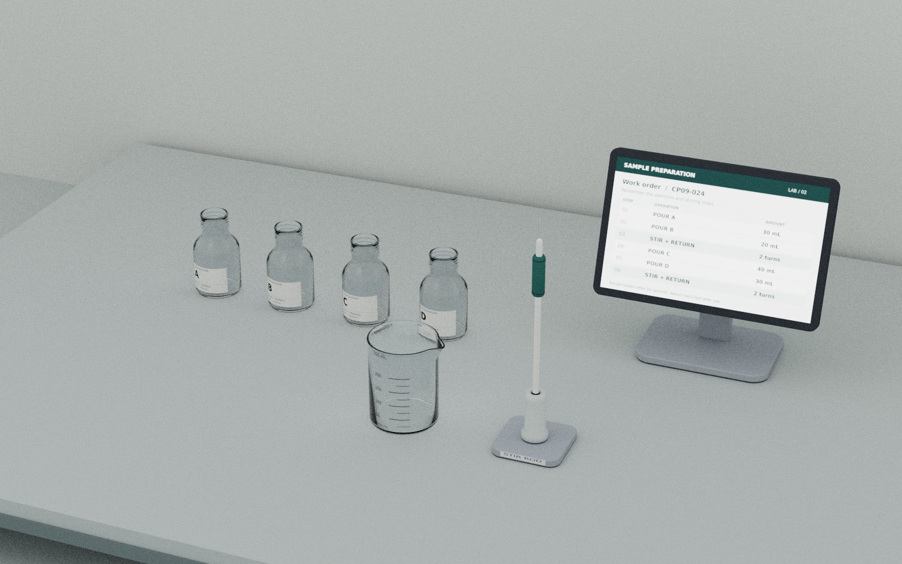

# CP03 · 实验配液

耦合套件

完整配方在桌面终端全程可见。机器人选择原料，依据烧杯刻度自由倒液，并按阶段完成搅拌、工具归位及后续配液。开头两秒仅用于观察与稳定；任务考察可见配方执行中的顺序、剂量和物理完成条件。

**核心挑战：** 每一步实际添加量和工具状态，能否可靠地支持下一阶段配液？

## 验证能力

- 可见配方的顺序与阶段依赖管理
- 自由倾倒中的剂量估计、停止和残余流动控制
- 搅拌工具的抓持、使用和稳定归位
- 基于实际剂量及完成阶段推进流程

## 高层、低层与闭环证据

- 高层目标：按全程可见配方选择原料与搅拌阶段
- 低层效果：控制本步添加量，完成搅拌及工具归位
- 闭环验收：按本步实际剂量和工具状态推进，预览不证明完整配方通过

## 执行流程

观察可见配方并稳定两秒 → 选择当前原料 → 倾倒并确认本步增量 → 按配方进入搅拌阶段 → 搅拌棒稳定归位 → 继续剩余配液 → 验收剂量与工具状态

## 难度设置

| 设置 | Easy | Medium | Hard |
|---|---|---|---|
| 配液步骤 | 2 次加液，2 种原料 | 3 次加液，3 种原料 | 4 次加液，4 种原料 |
| 搅拌安排（原子动作增加） | 不搅拌 | 全部加液后搅拌 1 次并归位 | 第 2 次与第 4 次加液后各搅拌 1 次，每次均归位 |
| 每步添加量容差 | 统一暂设 ±5 mL；试运行参数，待液体标定 | 相同，不额外收紧 | 相同，不额外收紧 |
| 剂量范围、启动观察与场景 | 20/30/40 mL；启动观察 2 秒；配方全程可见；容器、刻度、相机及布局扰动范围统一 | 相同 | 相同 |

## 完成条件与指标

原料种类与顺序正确，各步添加量满足标定后的容差，并按档位完成搅拌及每次工具归位。

- 完整配方执行成功率
- 原料选择与阶段顺序错误数
- 每步增量剂量误差与溢洒量
- 停止倾倒后的剂量偏移
- 搅拌及工具归位完成率

## 演示素材

- [倒液初步预览 · 00:42](../../media/videos/CP03__CP03_CP09_pour_preliminary_20260920.mp4)
- [搅拌初步预览 · 00:42](../../media/videos/CP03__CP03_CP09_stir_preliminary_20260920.mp4)

## 参数与评测说明

- 配方全程可见，不将隐藏配方记忆作为核心能力。剂量从 20/30/40 mL 采样，暂定 ±5 mL 需液体标定。
- 两段视频分别为倒液与搅拌初步预览，不能作为 Easy/Medium/Hard 完整流程通过的证据。
- Easy 两次加液；Medium 三次加液后搅拌归位；Hard 在第二次、第四次加液后分别搅拌归位。
