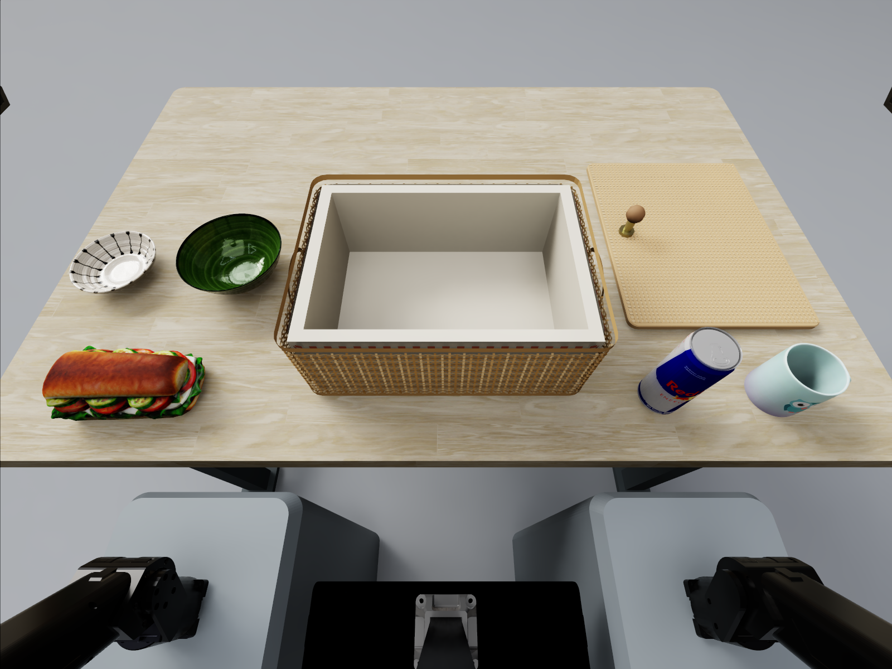

# CP04 · 野餐篮打包

自适应协同

将三明治、带把手杯、饮料罐及碗碟装入野餐篮，自行规划朝向、位置和顺序，利用器皿空腔与篮内净高。允许取出多件重排；全部装入后，抓起右侧可拆卸盖，对齐篮口并稳定盖合。

**核心挑战：** 空间上可行的布局，能否经由实际抓放实现，并在盖合前根据占用和干涉调整？

## 验证能力

- 不规则物体朝向、净高与器皿空腔的空间推理
- 层次与套放的操作顺序规划
- 接触、间隙和盖合的精细控制
- 根据实际占用更新布局并按需重排

## 高层、低层与闭环证据

- 高层目标：规划朝向、底层布局、套放和盖合顺序
- 低层效果：稳定放入且无穿透，盖子由篮沿支撑
- 闭环验收：以实际占用修订余下布局，最终闭盖检查空间方案是否成立

## 执行流程

观察篮内空间与器皿轮廓 → 规划底层、朝向与套放顺序 → 逐件放置并确认占用 → 必要时取出多件重排 → 提起并转正可拆卸盖 → 对齐篮口后落盖松手 → 确认稳定支撑并撤离

## 难度设置

| 设置 | Easy | Medium | Hard |
|---|---|---|---|
| 物品数量 | 3 件 | 4 件 | 5 件 |
| 空间编排压力（待实例验证） | 宽松，选择不规则物品朝向，多种布局可行 | 增加一处层次或套放依赖，需安排底层位置 | 联合安排底层、把手朝向与套放位置，错误布局可能需重排 |
| 摆放规则 | 候选：三明治、带把手杯、饮料罐；不强制套放 | 候选：增加大碗；验证一处套放或层次关系 | 候选：再增加浅碗；验证更多空间冲突与顺序依赖 |
| 调整与暂存 | 允许取出多件后重新摆放 | 相同 | 相同 |

## 完成条件与指标

所有物品稳定位于篮内且无实体穿透；盖子由篮沿稳定支撑，物品不顶盖，机械臂撤离。当前版本不设置搭扣。

- 全部装入并稳定盖合的成功率
- 空间约束与实体穿透违反数
- 物品稳定性及盖合干涉
- 重排次数与额外操作成本
- 实际占用变化后的计划修订

## 演示素材

## 参数与评测说明

- 三档为 3/4/5 件，空间编排压力与套放依赖仍待实例验证。
- 不限制单层、不强制饮料直立，允许多件桌面暂存；遇到干涉可提盖整理，但不强制发生返工。
- 当前提供场景图，未附完整执行视频；没有外部动态响应窗口，不作为频率主轴。
