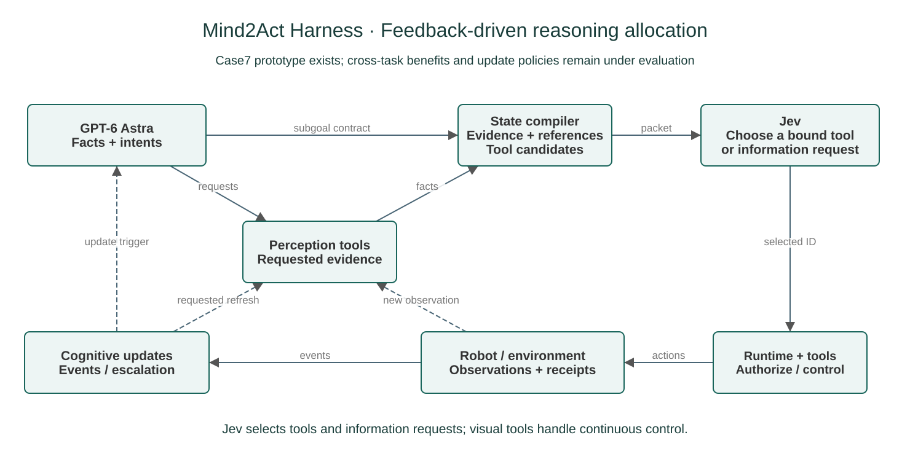
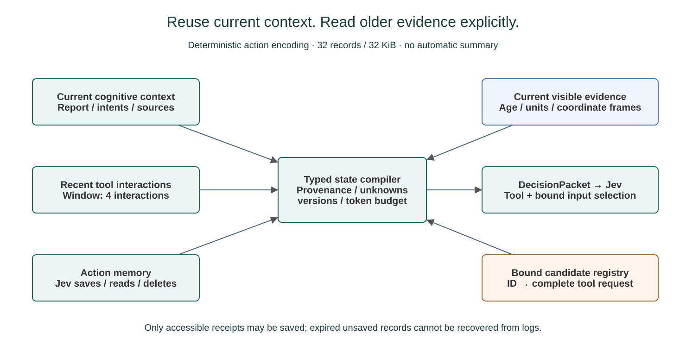
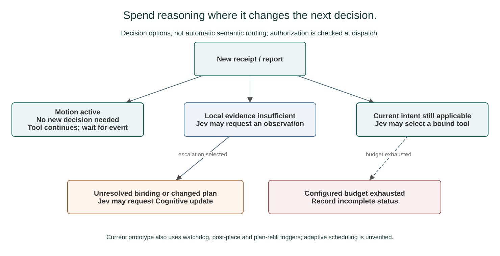

# Mind2Act Harness · Proposal v2

**Contract-Guided Coordination of Cognitive and Reactive Agents for Robotic Manipulation**

研究方向：**Feedback-Driven Coordination and Self-Improvement for Multi-Step Robotic Manipulation**。

版本：v2，2026-09-24 更新。状态：局内协作已有外部 Case7 开发原型；RSI 是紧接其后的实现重点，当前尚未接入 Jev 闭环。Mind2Act World 正式评测、协作与自我改进收益待验证。GPT-6 Astra 为上游配置名称；正式比较前固定请求设置，并记录实际返回的模型版本及计费依据。

## 1. 研究问题与三个设计假设

GPT-6 Astra 这类多模态工具 Agent 能解释任务、理解图像并调用机器人工具。进入多步物理操作后，每次动作可能改变场景，而重新获取图像和进行推理需要时间；命令执行结束也不保证目标效果已经发生。需要研究的问题是：哪些后续决策可以复用已有理解，哪些需要新观察或重新规划？

每个工具边界都重新进行完整视觉推理，可能产生冗余开销；长期沿用一次生成的计划，则可能在目标移动、遮挡变化或动作失败后继续使用失效依据。这是待验证的推理分配问题。现有开发日志中的几何检查、接口限制和服务故障不能单独证明 Astra 的推理能力不足。

**核心 insight：任务的语义目标与局部执行证据可能以不同速度变化。一次反馈可能只要求补充局部测量，也可能要求重新理解场景；推理投入应与这次决策所缺的信息相匹配。**

主要研究对象是目标可在若干操作中复用、但执行反馈会改变后续选择的多步任务。例如，整理桌面时搬运目标可以保持不变，但抓取失败需要补证据；动态配餐时订单相对稳定，食品位置与实际入盘量持续变化。任务长度本身不足以界定适用范围：固定无分支流水线可能只需规则控制，每一步都需新语义理解的任务也可能无法节省认知调用。

引入 Jev 的动机是让一次 Cognitive 理解支持多次局部工具决策，同时允许下游选择补观察、读取信息或请求重规划。它也增加文本交接、候选生成、信息检索和额外模型调用的代价。若每次 Jev 选择仍依赖 Astra 完整看图，或规则选择已足够完成任务，则这种分工可能不划算。

1. **Reusable Cognitive Context · 可复用的认知依据**：Astra 输出带来源的可见事实与短期意图，局部决策在授权范围内复用这些信息。需要检验可复用的决策比例及复用后的错误率。
2. **Feedback-Guided Local Decisions · 基于反馈的局部决策**：Jev 同时选择动作工具、信息获取和升级，而非只选择固定动作链的下一步。需要与相同工具的规则选择及 Astra 选择器比较。
3. **Demand-Driven Cognitive Updates · 按需认知更新**：依据新观察和执行结果决定何时请求高开销视觉推理，在保持任务表现的条件下改善总成本与完成时间。现有固定触发提供基线，不能视为已实现最优更新策略。

结构化交接、完整候选、有界上下文和异步执行是实现这些假设的机制。分层控制、工具选择和事件触发本身不构成新颖性结论；贡献需要通过匹配对照与相关工作核验建立。RSI 是下一阶段立即推进的组成部分：局内反馈指导当前行动，跨局反馈用于改进产生这些行动的经验与协作策略。首版研究不更新模型权重，而是让系统提出、验证并版本化改进自身的工具使用与交接方式。

## 2. 整体架构

**局内闭环：任务 / 观察 → Astra 可见事实与短期意图 → 状态编码与候选绑定 → Jev 选择工具 → 视觉执行工具 / Runtime → 新观察与回执**。局部决策可以继续操作、补充证据、读取信息或升级。

**局间闭环（待接入）：开发记录 → Critic 归因与改进候选 → 独立验证 → 发布或回滚 → 下一局使用固定版本**。已接受版本产生的新开发记录可触发后续改进轮次，形成持续迭代。

| 模块 | 职责 | 交接边界 |
| --- | --- | --- |
| Cognitive / Astra | 图像理解、未知项描述、短期意图与计划修订 | 提供依据和授权，不控制每个关节步 |
| Jev | 根据报告与回执选择工具及已有输入绑定 | 不直接读取 RGB，不生成任意连续控制，不越过授权改选目标 |
| 视觉执行工具 | 目标内的局部感知、几何计算、有限抓取与放置 | 返回实际进度和不确定性，不能把命令完成写成任务成功 |
| Runtime | 事件合并、共享状态、版本、动作所有权、取消确认及日志 | 校验和派发，不用私有评分指导线上决策 |
| Critic / RSI（待接入） | 在局间依据开发记录提出经验或策略补丁 | 无实时动作权，不能修改正在运行的策略或自行宣布候选有效 |
| 验证与版本管理（待接入） | 比较父版本与候选，保留证据、发布及回滚 | 验证门槛预先固定，新版本只在后续局生效 |
| 独立评测器 | 终局物理效果与整局成功 | 与 Agent 输入和在线恢复隔离 |

外部 Case7 原型已经接通局内执行闭环，复用了 EvoMemHarness 的会话、授权和执行生命周期基础；局间 RSI 尚未接入。本仓库维护方法说明与合成协议，不包含该原型的可运行副本；通用候选注册表、跨任务适配与成本路由仍需验证。

## 3. Astra 如何形成可交接的子目标

输入为任务指令、当前允许访问的图像／本体状态、实际执行回执与待解决事件。输出分为三部分：

- **VisibleReport**：当前可见事实、未知项、来源帧及采集时间；报告返回时同时保留采图之后的动作状态变化。
- **SubgoalContract**：目标、授权版本、源／目的区域或其他工具输入引用、约束及允许的操作。Case7 原型用最多三项 `TransferIntent` 实现这一接口。
- **PerceptionPlan**：当前缺少的证据及允许请求的感知能力。未测量的事实保留未知，不能由描述补造物理坐标。

无关未来计划更新不打断当前有效授权；撤销当前动作必须等待物理取消确认。Cognitive 的持久会话与任务理解独立维护，不代写 Jev 的动作记忆。

当前 Case7 在首次观察、计划耗尽、Jev 升级、结束确认、放置后、40 秒巡检及意图不足时补计划等条件下请求 Cognitive。同一角色最多一个请求在途，新触发合并并在下次请求前重新采图；已有有效授权可继续执行。这些是混合触发规则，尚不能描述为“只有必要时才介入”。

按需更新方案将检验：保留初次、计划耗尽和结束确认等生命周期请求后，能否由 Jev 根据反馈决定额外认知需求，减少例行更新而不损害任务表现。

## 4. Perception 到结构化文本：保留什么、拒绝什么

Jev 接收文本状态，视觉能力由 Cognitive 和显式调用的感知工具提供。结构化报告至少保留：

| 字段 | 作用 | 边界 |
| --- | --- | --- |
| observation_id / timestamp / source_tool | 区分新观察与旧报告 | 模型返回时间不能替代采图时间 |
| region_ref / binding_status | 指定当前可见区域与临时操作关联 | 不伪装成私有物体 ID 或可靠的全局追踪 |
| value / units / coordinate_frame | 表达位置、轮廓、方向与坐标依据 | 缺单位或合法变换时不补造控制坐标 |
| uncertainty / validity | 保留未知、遮挡、时效与绑定状态 | 旧文本仍在上下文不代表几何仍有效 |
| action_receipt / effect_evidence | 分开命令、实际进度与效果判断 | 工具完成不自动推进语义任务成功 |

Case7 默认提供最新观察的全部可见区域卡片，包括颜色、图像区域、可见位置／方向与不确定性；完整轮廓和诊断按需读取。旧报告以引用替代重复正文，读取遵守访问窗口，不能通过日志恢复不可访问记录。数值拟合质量不冒充校准后的置信度。

输入权限必须逐环境声明。历史 Case7 经授权使用公共 RGB-D、标定和机器人状态；迁移到 RoboDojo 时仍只使用 RGB 与本体状态，以及 Agent 主动请求的 RGB 推断深度／分割等工具。不得沿用环境深度、相机矩阵、物体真值或像素到世界坐标查询。公共测量与 RGB 预测不能在对照中混为同等支持。

不从隐藏布局或评分器补充模型信息；没有合法坐标变换时，动作绑定保持未知，由允许的估计或交互途径解决。局部感知只处理当前授权目标，失败后是否重试、补观察或升级由 Agent 决定。

## 5. Jev harness：工具与输入绑定的选择

现有适配器通过 Jev Choice 选择声明的候选。官方 State、Choice 与模型资料见文末；版本和限制应在正式实验前重新固定，不能把历史接口上限当作永久能力边界。

1. **State Compiler**：确定性组织当前意图、最新报告、近期回执、时效、记忆索引与候选。同一正文在单次请求中只出现一次；详情按访问权限读取。
2. **Candidate Registry**：根据工具接口、当前授权和有效输入机械绑定候选。每个候选表示完整工具请求，而不要求一次填入整个抓放轨迹的全部坐标；准备几何工具被选中后才计算参数。
3. **Jev Adapter**：普通操作一次选择“工具＋已绑定目标”，例如准备某个意图的抓取几何。详情查询单独分级为记录和页面，不把所有页面展开成数百个选项；不提供无有效输入的空绑定项。
4. **Post-response Guard**：模型返回后重新核对授权版本和动作所有权，迟到的失效选择返回明确回执。协议正确和模型 confidence 均不保证物理成功。
5. **Execution Runtime**：唯一动作入口、去重、互斥与取消确认。动作内部的接近、修正、吸附、抬升或释放由执行工具连续完成，不逐运动阶段询问 Jev。

Jev 可选择观察区域、检查区域、准备几何、抓取、放置、读详情、记忆操作、等待、取消、升级或请求结束。权限受当前工具与授权限制；候选中不存在的能力不能由模型选择弥补。

工具、执行互斥和任务策略应区分。Case7 v6 另有几何失败门控：某个工具＋意图版本被实测拒绝后，更新证据或授权才能再次派发。这改变了可用候选，属于显式工程干预，不能算作 Jev 自主避免重复失败的全部证据；迁移到 RoboDojo 时也不能擅自增加此类策略性规则。

本页 JSON 为合成接口示例，选中的候选为空。它们说明数据约定，不代表真实轨迹或本仓库已接通机器人。

## 6. 记忆窗口与记忆文本

局内动作记忆由 **Jev 决定保存、读取和删除，程序负责固定字段提取与编码**。Cognitive 可以显式读取共享记录，不代写它。当前实现区分以下信息：

| 类型 | 内容与责任 | 保留边界 |
| --- | --- | --- |
| 当前认知与计划 | Cognitive 的报告、未知项和有效授权 | 报告保留采图时间；更新不伪造新观察 |
| Recent event window | 最近四次工具交互及可访问引用 | 读取也计入窗口；退出窗口的未保存内容不可从日志取回 |
| ActionMemory | Jev 选定动作回执的固定编码：来源、参数、实际进度、终态与错误 | 每局空记忆，32 条／32 KiB；满容量报错，由 Jev 删除 |
| 当前感知与搬运状态 | 最新区域卡片、临时关联与实际测量 | 不是永久身份表；未知几何不得从旧摘要复活 |

`save(action_ref)` 只接受当前可访问的回执和当时已经获得的依据；没有测到的字段记未知。不调用额外模型摘要，不自动保存、淘汰、恢复隐藏形状或生成推荐动作。默认只给记忆索引，正文需主动读取。

Cognitive 的持久会话由既有 SDK 管理，与 Jev 的动作记忆分开计量。RSI 的已验证经验库则跨局保存；每局动作记忆仍从空开始，不把历史轨迹直接灌回当前窗口。原 v2 的自动 pinned facts、摘要记忆与全局场景缓存不作为当前实现：长序列任务若需要额外账本，应明确其作者、更新方式、访问权限与成本后单独评估。

已核对的 Case7 开发局均未调用 save/read/delete。因此清框成功不能证明主动记忆有效，也不能仅凭动作序列较长就声称解决长程记忆瓶颈。更强的历史依赖应在观察消失后的路线复现或订单任务中验证。

## 7. 成本感知调用与刷新

首份认知报告、工具完成／失败／取消、新认知更新触发 Jev；同时发生的事件合并。运动启动不立刻再问模型，`wait` 等待下一事件；请求在途期间的事件由带序号队列保留。

| 当前情况 | 决策路径 | 需要验证的代价与收益 |
| --- | --- | --- |
| 动作仍在有效授权下运行 | 执行工具继续；Runtime 等待回执或新事件 | 避免重复“继续”请求，不增加动作延迟 |
| 局部测量或绑定不足 | Jev 选择补观察、检查或升级 | 局部证据是否足够，是否减少无效重试 |
| 意图仍适用且存在多个操作 | Jev 选择完整工具请求 | 相比 Astra 或规则的质量和完整调用开销 |
| 指代歧义、计划冲突或候选不足 | Jev 可请求 Cognitive 修订理解与授权 | 是否及时升级，避免持续使用失效依据 |
| 预算不足 | 记录未完成状态与原因，按声明的预算终止 | 所有失败与已付出成本保留 |

Runtime 维护调用和执行协议，不替 Agent 判断任务语义是否已经改变。当前固定巡检与事件触发规则是实验基线；完全按需更新的触发质量尚未测量。若使用 confidence 阈值，需要独立校准，不能将候选相对偏好当作动作成功概率。

**成本账本**：C_total = C_Astra + C_perception + C_candidates + C_Jev + C_memory + C_retries + C_execution。记忆项包含实际检索／编码及已发生的会话压缩；API、GPU／工具与仿真资源分别报告，未知费用保持未知。

同时报告所有尝试的平均成本、总成本／成功 episode 数、严格成功率和失败／超时率。成功数为零时成本／成功数未定义；不能以提前放弃制造省钱结果。目标是在预先定义的任务质量与时限要求下比较完整系统。

异步耗时按区间并集与关键路径测量，不简单相加。减少一次模型调用不保证节省其整个响应时长，该调用可能与运动重叠。固定环境时钟、实际倍率、并发和机器负载；模型 API 延迟、相机帧率与机器人闭环响应频率分别记录。

## 8. RSI：从执行记录到协作策略改进

RSI 作为近期实现重点，沿用原双 Agent 的 Record–Critic–验证–版本发布基础。其研究问题是：**系统能否从自身执行中的重复问题出发，提出可迁移的协作改进，并在后续任务中验证它，而不依赖逐次人工修改？** 这里的 RSI 指系统级自我改进，首版保持模型权重、Critic 与验证规则固定。单纯保存更多历史不构成改进；候选必须改变后续行为，并有独立对照证据。

### 改进对象与职责

| 对象 | 首版改进形式 | 作用位置 |
| --- | --- | --- |
| Cognitive 经验 | 可见证据与意图交接的经验卡，含适用条件、反例和来源 | 帮助 Agent 改进报告、授权与重规划判断 |
| Jev 工具使用经验 | 关于工具回执、信息缺口、重试或升级的经验卡 | 供 Jev 主动读取，辅助选择；不自动替它派发动作 |
| 交接与调度 | 隔离分支中的小范围提示、编码或已声明调用配置补丁 | 经验闭环接通后扩展；经验证后作为新 harness 版本启用 |

Critic 使用独立会话的视觉／代码模型，先检查执行回执，再结合相关报告和选择记录，区分认知、选择、工具、接口和服务问题。Jev 继续承担在线 Choice，不要求它生成任意代码或自由文本总结。证据不足时允许不提出候选；服务中断不自动沉淀为机器人操作经验。

### 改进闭环

1. **形成记录。** 每局结束后生成 `EpisodeRecord`，保留当时合法可见的观察、角色输出、候选与选择、实际回执及版本。按开发批次触发 Critic；验证与正式测试记录不回流到改进队列。
2. **提出候选。** Critic 生成不可变的 `ImprovementCandidate`：父版本、改进对象、证据引用、问题假设、适用／失效条件、明确改动、预期收益和回退版本。经验由 Critic 撰写，程序负责来源和格式校验；不预写任务答案。
3. **隔离验证。** 先检查接口与权限，再在预留开发场景中比较父版本与候选的闭环表现。冻结评分标准与预算，计入 Critic、验证与失败候选开销；静态检查或单次成功不足以证明策略收益。
4. **发布或保留。** 达到预先定义的质量门槛且目标指标改善，才原子发布 `PolicySnapshot`；否则候选不激活。关联改动作为同一候选验证，保留接受与拒绝证据。
5. **后续局复用。** 每局固定读取一个版本，不中途热更新。后续开发证据暴露退化时，停用该版本并将未来局切回父版本；运行中的动作仍按原授权与取消协议结束。新的开发记录进入下一轮，形成迭代链。

`PolicySnapshot` 绑定 Cognitive／Jev 提示、工具与编码版本、调用配置及已验证经验目录。首版经验按 cognitive 与 tool-use 分库，提供短索引、适用范围和版本；正文由 Agent 按需读取，Jev 使用已绑定的经验读取候选。程序只按角色、工具能力与版本做兼容性检查，不替 Agent 进行任务语义匹配或筛选推荐动作。

### 动作 RSI 与 Jev 上下文边界

动作 RSI 改进的是**工具如何被使用**，不是让 Jev 学习低层关节轨迹，也不是把一整局历史塞回下一次请求。Jev 每次只评估当前的一份文本 `state`；Choice 适合在有限候选中选择，候选过多时应分层读取，而不是把经验库全部展开（参见 [TypeSafe State](https://docs.typesafe.ai/concepts/state) 与 [Choice](https://docs.typesafe.ai/primitives/choice)）。因此把 RSI 分成两个信息通道：

- **局内在线通道。** 当前 `DecisionPacket`、最近四次交互、局内动作记忆索引和少量经验卡摘要进入 Jev。Runtime 只按角色、工具能力和版本做兼容性过滤，并限制本次最多带入少量卡片；Jev 仍用一次 Choice 选择普通动作。需要经验细节时，先选择“读取经验”，再读取一个卡片或一个分区，读取结果只进入下一次请求。经验卡不含坐标、种子、隐藏布局或完整回放。
- **局间离线通道。** Runtime 将每次动作固定提取为 `ActionSlice`，Critic 在局间分批阅读这些短记录；跨多条记录的归因和候选合并也在离线会话中完成，绝不受在线 Jev 窗口牵制。候选通过独立验证后才写入下一版 `PolicySnapshot` 的经验索引。

首版经验卡固定包含：`card_id`、父版本、适用的工具／角色范围、触发证据、抽象的选择建议、反例、证据引用、风险和回退版本。经验只表达“遇到哪类回执时应重新获取证据、读取信息或请求升级”等可迁移的工具使用依据，不写成自动换目标、自动重抓或自动宣布成功的 Runtime 规则。以“几何准备失败后反复提交同一调用”为例，Critic 可以提出“回执表明当前依据不足时，先获取新证据或升级；不要把重复失败改写成成功”的候选；下一局由 Jev 看到摘要后自行选择，候选不直接执行。

上下文预算作为版本配置记录，而不是隐式截断：先测得 `B_state`、`B_history`、`B_cards` 和 `B_details`，再冻结每局的上限。实现起点可限制为最多 4 张经验卡、单卡约 512 tokens，详情一次只读一张；若经验库更大，采用“工具／角色范围 → 卡片 ID → 卡片分区”的分层 Choice 或分页。这样 Choice 选项数量和输入字节数都可审计，超预算时明确返回 `context_limit`，不静默丢轮廓、改写历史或切换模型。

动作 RSI 的验证对象也要分层：先验证卡片是否改变 Jev 的工具选择，再验证候选是否改善独立任务的成功率、重试次数、总成本和完成时间；低层控制器的轨迹质量另做工具版本测试。这样即使 Jev 的上下文很小，系统仍能在局间积累可验证改进，而不会把长期记忆伪装成在线上下文。

### 信息边界与近期落点

Critic 可在局间审阅该开发局原本可见的历史，这是声明的离线输入；在线 Jev 仍受局内窗口限制，不能借 RSI 查询完整旧日志。经验只保留可泛化的操作依据，不携带种子、物体私有 ID、隐藏布局或场景答案坐标。评分器保持隔离，验证服务只返回开发评测汇总与候选接受／拒绝结果。

候选只能改动声明的经验、提示、交接和调用配置；不能扩大观察权限、修改评分器／验证门槛、取消授权与物理停止协议，或把任务策略写成 Runtime 的自动兜底。工具能力变化须作为单独版本披露。历史 Case7 的 RGB-D 能力标签不能被经验读取绕过并迁移到 RGB-only RoboDojo。

近期先接通 **开发记录 → Critic → 双经验库候选 → 验证 → Jev／Cognitive 读取固定快照**，完成一次可追溯的候选接受或拒绝循环；随后加入受限的交接与调度补丁。没有候选通过验证是有效结果。原框架已有批次、经验和版本基础，但其轻量局部验证不等于当前 Jev 机器人闭环的 RSI 效果，仍需重新接入与验证。

## 9. 与当前案例对应

| 任务 | 主要特性 | 候选 / 更新难点 |
| --- | --- | --- |
| Case7 清框原型 | 多次搬运共享目标；动作改变可见区域与执行条件 | 局部几何、反馈后的选择及授权更新；不足以单独检验强记忆或动态时限 |
| E / P | 身份、订单累计量与实际完成量 | 目标绑定；抓放命令结束不等于实际完成 |
| S / M | 空间绑定、目标路线和重复到访 | 历史观测消失后的信息保持与序列推进 |
| F | 未知按钮映射与有效试验结果 | 无效执行不能记为规则证据 |
| FR1 / FR2 | 当前目标、运动窗口与释放状态 | 语义负担受控时，是否仍需要模型选择；端到端吞吐 |
| PR1 / PR2 / PR3 | 精确目标、轨迹与接触／残差 | 执行器能力是前提；调度不能替代精细控制 |
| CP01 / CP02 | 订单或布局相对稳定，目标位置与实际效果变化 | 认知复用、局部刷新和动态窗口之间的取舍 |
| CP03 动态槽架装盘 | 指定档位、移动空槽与稳定支撑的连续装载 | 跟踪与窄间隙动作绑定；专家运控演示不等于模型覆盖 |
| CP04 双臂配料与温控烹饪 | 隐藏配方、实际加料量及盖锅/恒温阶段前提 | 限时温控窗口待标定；双臂绕过对照与候选适配待验证 |
| CP05 电子琴复奏 | 琴键顺序、揭防尘布、Hard 音量调节与工具状态 | 同步取放、按序轮流击键；执行不要求跟拍 |

优先在独立 Case7 布局验证稳定性，再选择 CP01 或 CP02 的单一固定配置作为认知更新实验；FR1 可控制高层语义难度，M 适合记忆专项。任务网页和运控视频不代表已完成本方法接入。

“部分可观测”表示单帧可能不足以决策，不意味着环境完整状态的转移本身非马尔可夫。该方法的研究重点是由反馈决定所需推理，而非泛指所有非马尔可夫任务。

## 10. 验证设计

评测围绕以下问题展开：

- **局部选择是否需要 Jev？** 在相同报告、候选与工具下，对比 Jev、Astra 和规则选择。
- **何时需要更新认知？** 固定选择器与执行工具，对比频繁更新、现有固定触发和按需升级。
- **整体分工是否有收益？** 与使用相同工具的单 Astra Agent 比较，并在不同布局及具有动态反馈的任务中检验适用范围。
- **RSI 是否带来持续改进？** 在同等开发与改进预算下比较冻结版本与自主更新版本，检查独立任务上的收益、退化及改进成本；正式测试期间冻结版本，不据测试结果继续更新。

以独立评分的任务成功率为主，同时比较总成本和实际完成时间。输入权限、工具能力和资源预算保持一致，保留失败记录；记忆与异步机制的作用通过单独消融验证。

## 11. 初步验证与下一步

Case7 清框原型已完成从视觉理解、Jev 工具选择到机器人执行的闭环，并在开发场景中实现全部拼块出框。迭代减少了部分重复调用，但尚未体现整体加速或 Cognitive 调用减少；主动动作记忆的收益也未得到验证。这些迭代由开发者完成，不能作为自主 RSI 的证据。

现有结果来自同一场景的开发迭代，支持系统可运行性，尚不足以证明优于单 Agent、降低总成本或跨任务泛化。详细运行记录保存在[开发证据](../data/research/case7_development_evidence_20260924.json)中。

下一步以冻结的局内接口为基础，立即接入 RSI 的记录、Critic、候选验证与经验读取闭环，并行准备独立布局与同工具对照。随后扩展受限策略补丁，检验改进是否能在后续任务中保留。若减少模型调用未改善成功能力、成本与完成时间的取舍，则需调整分工或收缩适用任务范围。

## 12. 实现边界与资料

参考快照 `6d3c53eab6adcdfc7b7c4fdda7c9dba5d4fcce41` 提供 Cognitive–Reactive、局内 notes、动作授权与 Runtime 的基础。外部原型位于 RoboStream++ 的 `cognitive-reactive-harness-jev/case2` 与 `case7`，它支持清框可运行性的结论；本仓库仍维护提案与展示，不宣称已覆盖所有 World 任务。

本次更新加入 RSI 的近期设计并整理历史证据，不启动新模型或机器人实验；当前没有 Jev RSI 的实测收益。原始文件留在本地工作区；数据摘要提供 run ID、来源相对路径与 SHA-256，排除私有物体坐标和完整模型请求。哈希可用于持有原始文件时核对，不等于已提供完整可复现实验包。

与社区方案比较应固定版本并核对观察来源、工具能力、候选范围与更新规则。不能将 embodied-jev 简化成仅按方向移动，也不能把结构化游戏状态与视觉机器人输入当作相同条件。相关工作查新与方法优越性均待完成。

- [Case7 开发证据](../data/research/case7_development_evidence_20260924.json)：历史计数、离线结果与来源哈希。
- [TypeSafe State](https://docs.typesafe.ai/concepts/state)：文本状态与请求上下文。
- [TypeSafe Choice](https://docs.typesafe.ai/primitives/choice)：候选选择接口。
- [TypeSafe Models](https://docs.typesafe.ai/models)：部署前确认版本、限制与计费。
- [TypeSafe Confidence](https://docs.typesafe.ai/confidence)：置信度解释与边界。
- [EvoMemHarness 参考快照](https://github.com/MuQY1818/mem-planner-harness/tree/6d3c53eab6adcdfc7b7c4fdda7c9dba5d4fcce41)：授权与执行生命周期的工程基础。
- [RoboICL 参考项目页](https://mosi-ai.github.io/RoboICL-GPT6-Astra.github.io/)：页面组织参考，不借用其结果或贡献主张。
