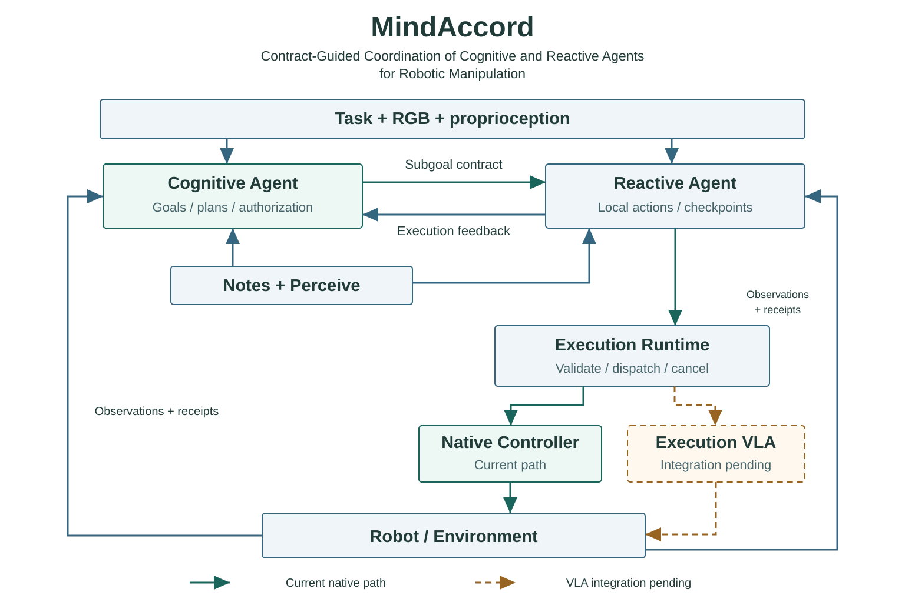
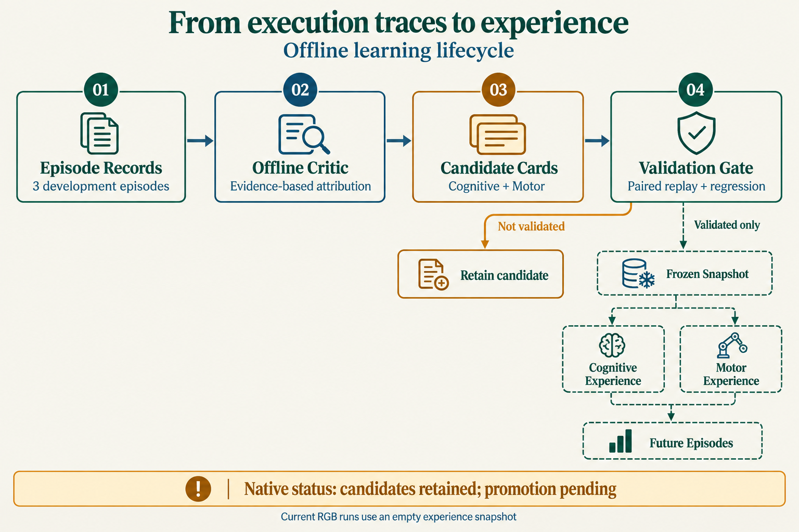

# MindAccord

Contract-Guided Coordination of Cognitive and Reactive Agents for Robotic Manipulation

实现基础：[EvoMemHarness](https://github.com/MuQY1818/mem-planner-harness/tree/6d3c53eab6adcdfc7b7c4fdda7c9dba5d4fcce41)。

当前原生路径为 Cognitive–Reactive + 固定控制器；VLA 接口已经定义，checkpoint 接入待完成。

## 总体架构

Cognitive 通过 Subgoal Contract 授权 Reactive；Reactive 经 Runtime 派发动作。Notes 与 Perceive 服务两个角色，但不持有物理执行权。环境观察和动作回执回到双方。

## 模块职责

### Cognitive Agent

**状态：** 已实现 · 原生协议

维护长程目标和有效进度，决定当前应完成哪个子目标。可以在 Reactive 执行期间推理后续计划；普通笔记和无关未来计划更新不应撤销正在执行的授权。

- 输入：任务文本、当前 RGB / 本体状态、执行事件、局内笔记
- 输出：任务依赖图、当前子目标、版本化授权与计划修订
- 边界：不直接提交物理动作；完成声明属于模型判断。

代码依据：[Cognitive / Reactive 结构化接口](https://github.com/MuQY1818/mem-planner-harness/blob/6d3c53eab6adcdfc7b7c4fdda7c9dba5d4fcce41/cognitive-reactive-harness/src/cr_harness/robodojo/rgb_protocol.py#L25)；[双会话异步运行](https://github.com/MuQY1818/mem-planner-harness/blob/6d3c53eab6adcdfc7b7c4fdda7c9dba5d4fcce41/cognitive-reactive-harness/src/cr_harness/robodojo/runner.py#L294)

### Reactive Agent

**状态：** 已实现 · 原生协议

在 Cognitive 的授权下选择工具与参数，依据新观测判断动作效果。当前它仍是模型会话，不等于高频控制器，也不等于 VLA；高频关节跟踪交给执行后端。

- 输入：当前授权、RGB / 本体状态、动作回执、局内笔记
- 输出：原子动作、最多八步的有限批次、检查点、恢复或升级请求
- 边界：不能自行更换授权目标；批次完成只表示动作执行结束。

代码依据：[Cognitive / Reactive 结构化接口](https://github.com/MuQY1818/mem-planner-harness/blob/6d3c53eab6adcdfc7b7c4fdda7c9dba5d4fcce41/cognitive-reactive-harness/src/cr_harness/robodojo/rgb_protocol.py#L25)；[当前原生协议 · coordination-v3](https://github.com/MuQY1818/mem-planner-harness/blob/6d3c53eab6adcdfc7b7c4fdda7c9dba5d4fcce41/cognitive-reactive-harness/docs/runtime-tools-notes-v3.md#L1)

### Subgoal Contract

**状态：** 已实现 · 原生协议

将任务意图绑定到有限执行范围。动作携带子目标与授权版本；撤销授权时先停止派发并等待取消确认。过期结果不能恢复旧授权。

- 输入：Cognitive 的当前子目标、工具许可、预算与任务依赖
- 输出：Reactive 可使用的稳定授权及其版本
- 边界：合同管理执行权限，不为任务生成坐标或预设成功答案。

代码依据：[Cognitive / Reactive 结构化接口](https://github.com/MuQY1818/mem-planner-harness/blob/6d3c53eab6adcdfc7b7c4fdda7c9dba5d4fcce41/cognitive-reactive-harness/src/cr_harness/robodojo/rgb_protocol.py#L25)；[双会话异步运行](https://github.com/MuQY1818/mem-planner-harness/blob/6d3c53eab6adcdfc7b7c4fdda7c9dba5d4fcce41/cognitive-reactive-harness/src/cr_harness/robodojo/runner.py#L294)；[当前原生协议 · coordination-v3](https://github.com/MuQY1818/mem-planner-harness/blob/6d3c53eab6adcdfc7b7c4fdda7c9dba5d4fcce41/cognitive-reactive-harness/docs/runtime-tools-notes-v3.md#L1)

### Execution Runtime

**状态：** 已实现 · 原生协议

管理单一动作归属、请求去重、来源时效、逐步派发和取消确认。Agent 显式设定检查点；失败、预算耗尽和授权失效也会停止下一步。

- 输入：动作请求、当前授权、批次游标、来源帧与预算
- 输出：控制指令、动作回执、拒绝 / 取消事件与执行记录
- 边界：不自动试抬、重抓或计算任务完成；工作空间范围不是通用避碰证明。

代码依据：[当前原生协议 · coordination-v3](https://github.com/MuQY1818/mem-planner-harness/blob/6d3c53eab6adcdfc7b7c4fdda7c9dba5d4fcce41/cognitive-reactive-harness/docs/runtime-tools-notes-v3.md#L1)；[双会话异步运行](https://github.com/MuQY1818/mem-planner-harness/blob/6d3c53eab6adcdfc7b7c4fdda7c9dba5d4fcce41/cognitive-reactive-harness/src/cr_harness/robodojo/runner.py#L294)

### Notes + Perceive

**状态：** 已实现 · 按需调用

两角色都可主动调用感知与笔记。感知只处理实际提供的 RGB，Depth Pro 的深度属于预测；notes 保存局内自由文本，另一角色须显式读取共享正文。

- 输入：当前 RGB、显式像素 / 框提示，私有或共享笔记的键与版本
- 输出：分割 / 预测深度 / 相机空间测量，主动读取的笔记正文
- 边界：无环境 GT 深度或相机标定；笔记不等于跨 Episode 经验。

代码依据：[局内私有 / 共享笔记](https://github.com/MuQY1818/mem-planner-harness/blob/6d3c53eab6adcdfc7b7c4fdda7c9dba5d4fcce41/cognitive-reactive-harness/src/cr_harness/notes.py#L8)；[按需 RGB 感知](https://github.com/MuQY1818/mem-planner-harness/blob/6d3c53eab6adcdfc7b7c4fdda7c9dba5d4fcce41/cognitive-reactive-harness/src/cr_harness/robodojo/agent_tools.py#L153)；[观察和经验输入边界](https://github.com/MuQY1818/mem-planner-harness/blob/6d3c53eab6adcdfc7b7c4fdda7c9dba5d4fcce41/cognitive-reactive-harness/src/cr_harness/robodojo/observation_policy.py#L1)

### Native Controller

**状态：** 已实现 · 原生接口

当前原生接口使用确定性运控。25 Hz 指执行动作行，底层物理子步与 Agent 推理频率另行记录；模型推理时物理继续推进，wall time scale 仍需披露。

- 输入：observe / move_to / set_gripper / wait_steps
- 输出：IK / 轨迹转换后的实际关节动作及本体回执
- 边界：工具执行成功不能单独证明抓住、放稳或任务达标。

代码依据：[原生运行配置](https://github.com/MuQY1818/mem-planner-harness/blob/6d3c53eab6adcdfc7b7c4fdda7c9dba5d4fcce41/cognitive-reactive-harness/src/cr_harness/robodojo/campaign.py#L85)；[当前原生协议 · coordination-v3](https://github.com/MuQY1818/mem-planner-harness/blob/6d3c53eab6adcdfc7b7c4fdda7c9dba5d4fcce41/cognitive-reactive-harness/docs/runtime-tools-notes-v3.md#L1)

### Execution VLA

**状态：** 已有接口 · 双 Agent 接入待完成

目标架构中，Reactive 可将适合学习式执行的局部动作交给 VLA。仓库已定义 checkpoint 无关接口，并有独立 RMBench / RoboTwin VLA 后端；当前双 Agent 原生 campaign 仍设置 unavailable。

- 输入：局部指令、相机图像、本体状态、动作长度与时长预算
- 输出：带 policy_id、动作空间和控制周期的 ActionChunk
- 边界：尚不能将这条双 Agent 原生路径称为已运行的 checkpoint VLA 系统。

代码依据：[VLA 动作块接口](https://github.com/MuQY1818/mem-planner-harness/blob/6d3c53eab6adcdfc7b7c4fdda7c9dba5d4fcce41/cognitive-reactive-harness/src/cr_harness/vla.py#L11)；[原生运行配置](https://github.com/MuQY1818/mem-planner-harness/blob/6d3c53eab6adcdfc7b7c4fdda7c9dba5d4fcce41/cognitive-reactive-harness/src/cr_harness/robodojo/campaign.py#L85)；[仓库已有 RMBench X-VLA 适配](https://github.com/MuQY1818/mem-planner-harness/blob/6d3c53eab6adcdfc7b7c4fdda7c9dba5d4fcce41/robots/rmbench/xvla_backend.py#L101)

### Experience Engine

**状态：** 已有机制 · 原生晋升待验证

三条新开发记录触发离线 Critic；候选区分认知、运动与系统原因。通用存储支持验证后原子发布。原生 Critic 当前保留候选，新的 RGB 原生运行只接受空经验快照。

- 输入：已结束的开发 EpisodeRecord、调用事件与最终结果
- 输出：认知 / 运动候选卡、验证记录、冻结经验版本
- 边界：轻量环境验证不替代原生回放；SEM-Memory 效果后验和自动回滚仍属后续设计。

代码依据：[跨局双经验库](https://github.com/MuQY1818/mem-planner-harness/blob/6d3c53eab6adcdfc7b7c4fdda7c9dba5d4fcce41/cognitive-reactive-harness/src/cr_harness/memory.py#L11)；[原生 Critic 的晋升边界](https://github.com/MuQY1818/mem-planner-harness/blob/6d3c53eab6adcdfc7b7c4fdda7c9dba5d4fcce41/cognitive-reactive-harness/src/cr_harness/robodojo/critic.py#L11)；[观察和经验输入边界](https://github.com/MuQY1818/mem-planner-harness/blob/6d3c53eab6adcdfc7b7c4fdda7c9dba5d4fcce41/cognitive-reactive-harness/src/cr_harness/robodojo/observation_policy.py#L1)；[独立 Motor RSI 试点](https://github.com/MuQY1818/mem-planner-harness/blob/6d3c53eab6adcdfc7b7c4fdda7c9dba5d4fcce41/robots/rmbench/motor/README.md#L1)

## 执行反馈

### 当前执行继续，任务层可规划后续

- Cognitive：保持当前子目标的授权，利用已有反馈维护未来依赖。无关计划变更不打断当前动作。
- Reactive：等待动作回执，或在显式检查点接收新观测，再决定下一步。
- Runtime：独占动作入口，逐步派发并记录实际执行量；推理期间环境仍可继续推进。

动作已派发、正在执行与子目标已完成是不同状态。

### 补充证据，再决定是否推进

- Cognitive：保留未确认状态，避免把后继子目标建立在未经确认的前提上。
- Reactive：主动观察，必要时调用感知或读取笔记，提交带来源的效果判断。
- Runtime：检查动作 ID、帧来源、授权和判断版本；记录 agent_judgment，不替模型判断图像中的物理真值。

在线 achieved 是由模型判断支持的状态；最终成功由独立环境评分器确认。

### 先停止旧执行，再接受新任务

- Cognitive：根据关键反馈修订当前子目标，发布新版本授权。
- Reactive：取消旧动作或批次；收到确认后，在新授权下重新决策。
- Runtime：停止后续派发，等待取消确认；拒绝迟到的旧版本请求，避免两个意图同时控制机器人。

计划更新不等于物理动作立即停止；取消确认属于层间交接协议。

## 双层经验

局内 notes 按 Episode 隔离，正文由 Agent 主动读写。跨局经验从开发 Record 开始，每三条触发离线 Critic，形成认知或运动候选。只有验证通过后才能发布冻结快照供后续 Episode 使用。

当前原生候选缺少 paired native replay / regression validator，暂不晋升；RGB 原生入口只接受空经验快照。SEM-Memory 效果后验与自动回滚属于后续设计。

## 与 Bench 的能力对应

| 维度 | 模块 | 能力 | 证据 |
|---|---|---|---|
| Task-Level Reasoning · 任务级推理 | Cognitive + Notes | 任务理解、状态维护与重规划 | 检查目标、依赖和剩余需求是否正确。 |
| Constraint-Aware Execution · 约束感知执行 | Reactive + 执行后端 | 精度、响应与持续接触 | 记录实际物理误差、执行时延与有效交互频率。 |
| Reasoning–Acting Coordination · 推理—执行协同 | Contract + 执行反馈 | 效果驱动的进度推进 | 检查是否根据实际执行反馈修订后续决策。 |
| 迁移（附加协议） | Cognitive / Motor Experience | 冻结经验的跨局复用 | 在独立实例上比较首次表现、恢复成本与负迁移。 |

[任务定义与演示见 MindActWorld](../../index.html)。迁移是附加协议，不是新增任务套件。

## 来源

- [当前原生协议 · coordination-v3](https://github.com/MuQY1818/mem-planner-harness/blob/6d3c53eab6adcdfc7b7c4fdda7c9dba5d4fcce41/cognitive-reactive-harness/docs/runtime-tools-notes-v3.md#L1)：职责、RGB 推断感知、notes、动作批次与效果判断的当前定义。
- [Cognitive / Reactive 结构化接口](https://github.com/MuQY1818/mem-planner-harness/blob/6d3c53eab6adcdfc7b7c4fdda7c9dba5d4fcce41/cognitive-reactive-harness/src/cr_harness/robodojo/rgb_protocol.py#L25)：RGBPlan、RGBAction、两角色工具请求与提示词。
- [双会话异步运行](https://github.com/MuQY1818/mem-planner-harness/blob/6d3c53eab6adcdfc7b7c4fdda7c9dba5d4fcce41/cognitive-reactive-harness/src/cr_harness/robodojo/runner.py#L294)：观测、认知、反应与环境事件的独立循环。
- [效果判断的证据与版本](https://github.com/MuQY1818/mem-planner-harness/blob/6d3c53eab6adcdfc7b7c4fdda7c9dba5d4fcce41/cognitive-reactive-harness/src/cr_harness/robodojo/coordination.py#L392)：当前 RGB 路径记录 agent_judgment，verified=False。
- [局内私有 / 共享笔记](https://github.com/MuQY1818/mem-planner-harness/blob/6d3c53eab6adcdfc7b7c4fdda7c9dba5d4fcce41/cognitive-reactive-harness/src/cr_harness/notes.py#L8)：按 Episode 隔离；主动读写、版本冲突检查、容量约束。
- [按需 RGB 感知](https://github.com/MuQY1818/mem-planner-harness/blob/6d3c53eab6adcdfc7b7c4fdda7c9dba5d4fcce41/cognitive-reactive-harness/src/cr_harness/robodojo/agent_tools.py#L153)：Depth Pro / SAM3 与同帧测量；预测相机空间结果。
- [观察和经验输入边界](https://github.com/MuQY1818/mem-planner-harness/blob/6d3c53eab6adcdfc7b7c4fdda7c9dba5d4fcce41/cognitive-reactive-harness/src/cr_harness/robodojo/observation_policy.py#L1)：rgb_proprio_inferred_tools_v2；禁止环境深度与标定；当前原生路径要求空经验快照。
- [VLA 动作块接口](https://github.com/MuQY1818/mem-planner-harness/blob/6d3c53eab6adcdfc7b7c4fdda7c9dba5d4fcce41/cognitive-reactive-harness/src/cr_harness/vla.py#L11)：VLAInput → ActionChunk；动作空间、维度、时长和取消检查。
- [原生运行配置](https://github.com/MuQY1818/mem-planner-harness/blob/6d3c53eab6adcdfc7b7c4fdda7c9dba5d4fcce41/cognitive-reactive-harness/src/cr_harness/robodojo/campaign.py#L85)：25 Hz 动作行、持续物理时钟、vla_mode=unavailable。
- [跨局双经验库](https://github.com/MuQY1818/mem-planner-harness/blob/6d3c53eab6adcdfc7b7c4fdda7c9dba5d4fcce41/cognitive-reactive-harness/src/cr_harness/memory.py#L11)：每三条开发 Record 分组；候选验证、关联卡原子发布与版本快照。
- [原生 Critic 的晋升边界](https://github.com/MuQY1818/mem-planner-harness/blob/6d3c53eab6adcdfc7b7c4fdda7c9dba5d4fcce41/cognitive-reactive-harness/src/cr_harness/robodojo/critic.py#L11)：原生候选缺少 paired replay / regression validator，当前 admitted=False。
- [EvoMemHarness · Planner–Runner–RSI](https://github.com/MuQY1818/mem-planner-harness/blob/6d3c53eab6adcdfc7b7c4fdda7c9dba5d4fcce41/docs/EVOMEMHARNESS.md#L1)：program-v1 的逐调用账本、经验目录、Critic 与独立 DEV 验证。
- [仓库已有 RMBench X-VLA 适配](https://github.com/MuQY1818/mem-planner-harness/blob/6d3c53eab6adcdfc7b7c4fdda7c9dba5d4fcce41/robots/rmbench/xvla_backend.py#L101)：三路 RGB、本体状态及 20D 动作转换；不同于双 Agent 原生路径的接入状态。
- [独立 Motor RSI 试点](https://github.com/MuQY1818/mem-planner-harness/blob/6d3c53eab6adcdfc7b7c4fdda7c9dba5d4fcce41/robots/rmbench/motor/README.md#L1)：Swap T 的受限程序修复试点，不能当作已整合的 VLA 或双层自进化结果。
